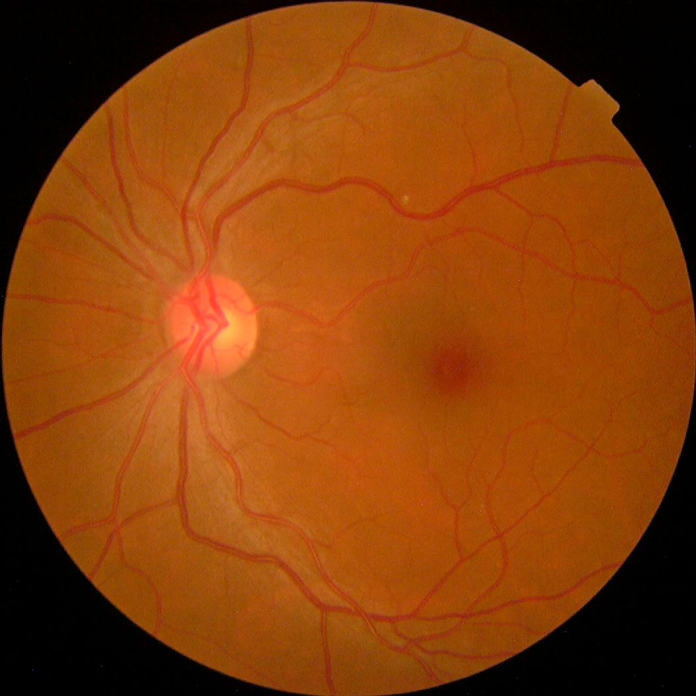
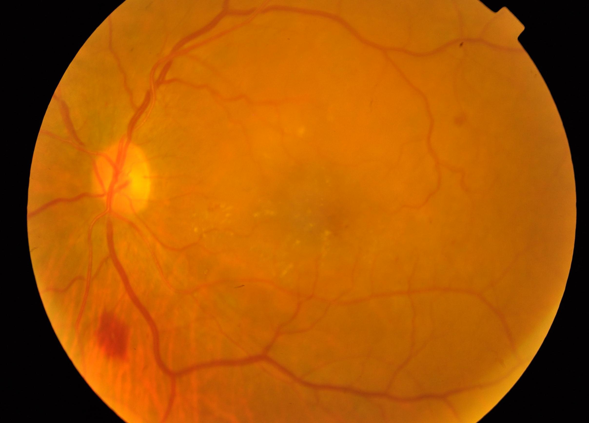
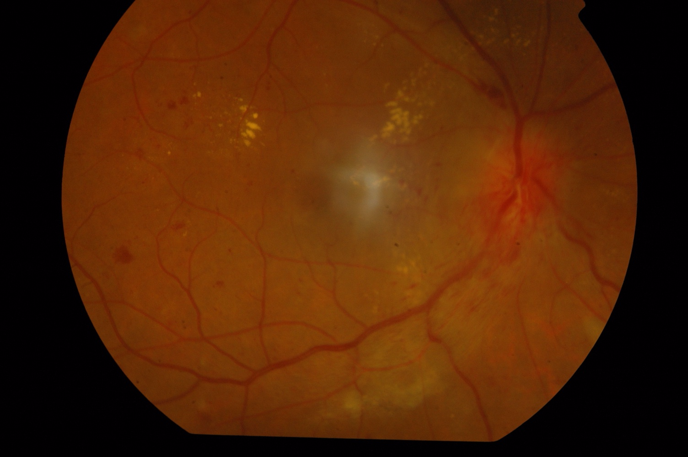
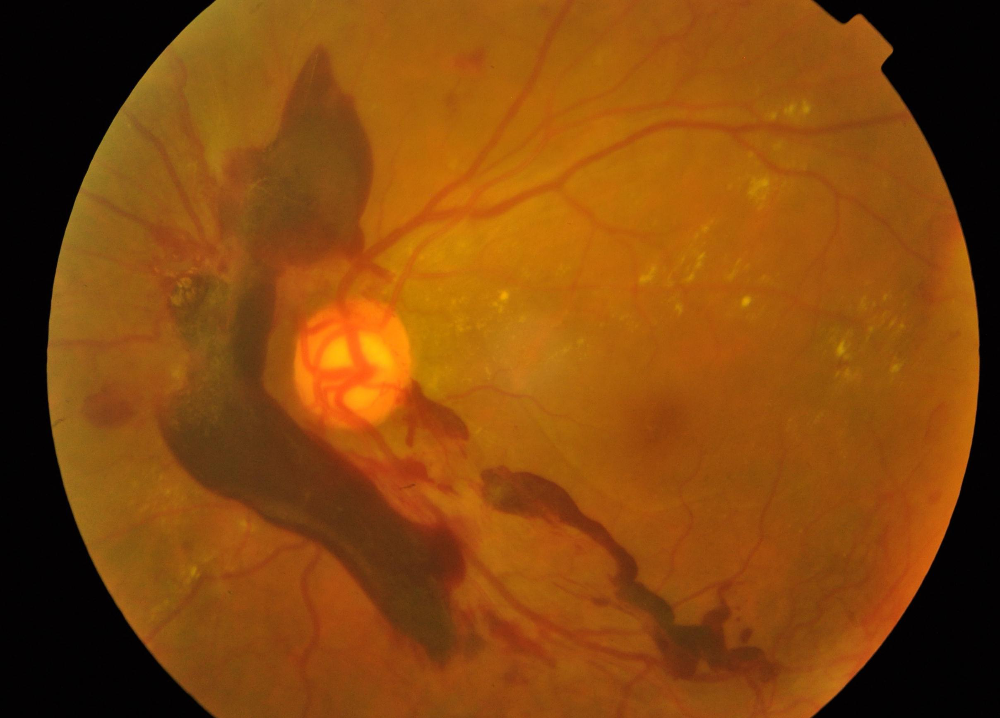
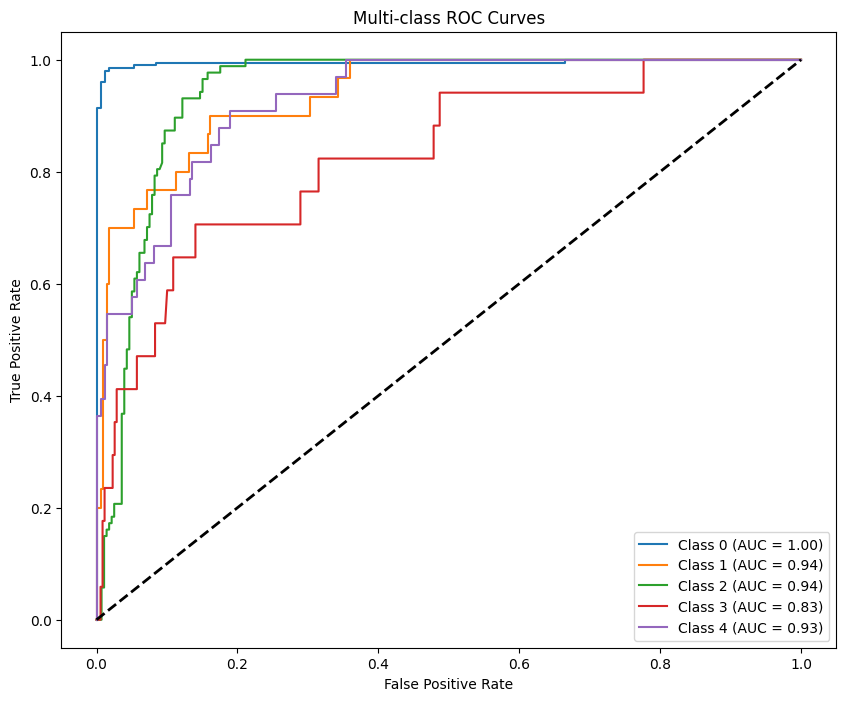
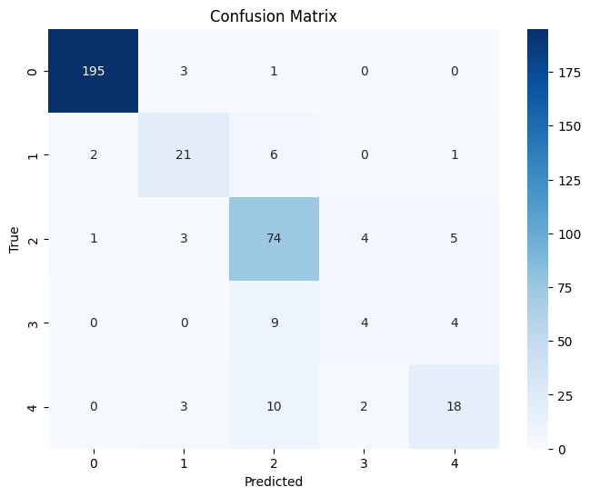

## 🚀 Overview

**DR-Diagnose** is an innovative Android mobile application designed to assist patients in detecting and managing Diabetic Retinopathy (DR), a leading cause of blindness among diabetic patients. By combining advanced deep learning with natural language processing, this app provides a seamless experience for patients to monitor their health and receive AI-driven medical consultations—all from their smartphones.

This project was developed for the **Code Fest 2025 Competition**, showcasing the power of AI in healthcare through efficient model deployment, robust evaluation, and user-friendly design.

### Key Features
- **Patient Data Input**: Collects comprehensive patient information, including:
  - Name
  - Diabetes Type (Type 1, Type 2, etc.)
  - Blood Glucose Level
  - Blood Pressure
  - Current Symptoms
  - Age
  - Gender
  - Diabetes History (number of years)
  - Retina Image Upload
- **Diabetic Retinopathy Prediction**: Uses an EfficientNet-B0 model trained on the APTOS 2019 dataset to predict DR severity (0–4 scale).
- **AI-Driven Diagnosis**: Integrates predictions with patient data and sends them to Gemini-Flash 2.0 for a detailed medical consultation response.
- **Lightweight Deployment**: EfficientNet-B0 model converted to TorchScript for on-device inference on Android, ensuring fast and efficient predictions.

---

## 📊 Dataset: APTOS 2019 Blindness Detection

The app leverages the **APTOS 2019 Blindness Detection dataset**, a publicly available dataset provided by the Asia Pacific Tele-Ophthalmology Society (APTOS). This dataset is widely used for Diabetic Retinopathy detection tasks and contains high-quality retina images labeled by medical professionals.

- **Size**: 3,662 retina images.
- **Labels**: 5 severity levels of Diabetic Retinopathy (0: No DR, 1: Mild, 2: Moderate, 3: Severe, 4: Proliferative DR).
- **Source**: Real-world clinical data from Aravind Eye Hospital in India.
- **Challenges**: The dataset includes imbalanced classes, with a higher number of "No DR" (Class 0) images, requiring careful handling during training to ensure model robustness.

<table>
  <tr>
    <th>No DR</th>
    <th>Mild</th>
    <th>Moderate</th>
    <th>Severe</th>
    <th>Proliferative DR</th>
  </tr>
  <tr>
    <td></td>
    <td></td>
    <td></td>
    <td></td>
    <td></td>
  </tr>
</table>

## Dataset Split

The dataset was split into training, validation, and test sets, with metadata stored in CSV files and images organized in directories.

## Data Preprocessing

- **Image Resizing**: All retina images were resized to `224x224` pixels to align with the input requirements of the EfficientNet-B0 model.  
- **Normalization**: Images were normalized using ImageNet-pretrained model standards (mean: `[0.485, 0.456, 0.406]`, standard deviation: `[0.229, 0.224, 0.225]`) to ensure consistent scaling for model input.

---

## 🤖 Model: EfficientNet-B0

The core of the DR prediction system is the **EfficientNet-B0** model, a state-of-the-art convolutional neural network (CNN) known for its balance of performance and efficiency.

### Why EfficientNet-B0?
- **Efficiency**: Optimized for mobile deployment with a small model size and low computational requirements.
- **Performance**: Achieves high accuracy through compound scaling of depth, width, and resolution.
- **Pretrained Weights**: Fine-tuned on the APTOS 2019 dataset, starting from ImageNet pretrained weights for faster convergence.

<h2>Model Overview</h2>

The Diabetic Retinopathy (DR) severity prediction model is built using EfficientNet-B0, a lightweight and efficient convolutional neural network (CNN) pre-trained on ImageNet (IMAGENET1K_V1 weights). The model is customized for a 5-class classification task to predict DR severity levels: No DR (0), Mild (1), Moderate (2), Severe (3), and Proliferative (4).

This model was trained in a short window of 10 hours due to time constraints of CodeFest competition. A more focussed and optimized training would result in better trained model.

<h3>Architecture Modifications</h3>
<ul>
<li>The original EfficientNet-B0 classifier head is replaced with a custom sequence:
<ul>
<li>Linear layer (1280 → 512) to reduce dimensionality.</li>
<li>ReLU activation for non-linearity.</li>
<li>Dropout (30%) to prevent overfitting.</li>
<li>Final linear layer (512 → 5) to output logits for the 5 DR classes.</li>
</ul>
</li>
</ul>
<h3>Device</h3>

Automatically utilizes GPU (CUDA) if available; otherwise, defaults to CPU.

<h2>Training Setup</h2>

The model is trained using a supervised learning approach with the following configuration:

<h3>Loss Function</h3>
<ul>
<li>Cross-Entropy Loss, suitable for multi-class classification.</li>
</ul>
<h3>Optimizer</h3>
<ul>
<li>AdamW with an initial learning rate of 0.0001, incorporating weight decay for regularization.</li>
</ul>
<h3>Learning Rate Scheduler</h3>
<ul>
<li>StepLR reduces the learning rate by 50% every 2 epochs for better convergence.</li>
</ul>
<h3>Training Duration</h3>
<ul>
<li>5 epochs, with performance evaluated on training, validation, and test sets after each epoch.</li>
</ul>

<h2>Training and Evaluation Process</h2>
<h3>Training</h3>

The model is trained on the training set, optimizing the loss using backpropagation and AdamW.

<h3>Validation</h3>

After each epoch, the model is evaluated on the validation set to monitor generalization.

<h3>Testing</h3>

The test set performance is also computed per epoch to assess overall model capability.

<h3>Metrics</h3>

Both loss and accuracy are calculated for training, validation, and test sets, providing a comprehensive view of model performance during training.

<h2>Model Usage</h2>

The trained model is integrated into the Android app for on-device inference:

<h3>Deployment</h3>
<ul>
<li>Converted to TorchScript for efficient execution on mobile devices.</li>
</ul>
<h3>Inference</h3>
<ul>
<li>Processes preprocessed retina images (resized to 224x224 pixels and normalized) to predict DR severity, which is then used alongside patient data for AI-driven diagnosis via Gemini-Flash 2.0.</li>
</ul>
---

## 📈 Model Evaluation

The EfficientNet-B0 model was rigorously evaluated on a test set of 366 images from the APTOS 2019 dataset. Below are the key metrics that highlight its strong performance:

### Test Accuracy
- **Overall Accuracy**: 85.25%  
  The model correctly classified 85.25% of the test samples, demonstrating its reliability across all DR severity levels.

### Quadratic Weighted Kappa (QWK)
- **QWK Score**: 0.8895  
  QWK is a standard metric for ordinal classification tasks like DR severity prediction. A score of 0.8895 indicates excellent agreement between predicted and true labels, accounting for the ordinal nature of the classes.

### ROC Curves
The Receiver Operating Characteristic (ROC) curves show the model's ability to distinguish between classes. The Area Under the Curve (AUC) for each class is as follows:
- Class 0 (No DR): AUC = 1.00
- Class 1 (Mild): AUC = 0.94
- Class 2 (Moderate): AUC = 0.94
- Class 3 (Severe): AUC = 0.83
- Class 4 (Proliferative): AUC = 0.93

### Confusion Matrix
The confusion matrix visualizes the model's predictions against true labels, showing strong performance, especially for Classes 0 and 2, which have the highest support.

### Classification Report Highlights
- **Class 0 (No DR)**: Precision = 0.9848, Recall = 0.9799, F1-Score = 0.9824
- **Class 2 (Moderate)**: Precision = 0.7400, Recall = 0.8506, F1-Score = 0.7914
- **Weighted Average F1-Score**: 0.8466, reflecting robust performance across imbalanced classes.

---

## 🛠️ App Workflow

1. **Patient Input**: The user enters their details (name, diabetes type, blood glucose level, blood pressure, symptoms, age, gender, diabetes history) and uploads a retina image.
2. **DR Prediction**: The EfficientNet-B0 model processes the retina image and predicts the DR severity (0–4).
3. **AI Consultation**: The app combines the patient’s input data with the DR prediction and sends it to **Gemini-Flash 2.0**, which generates a detailed medical consultation response.
4. **Diagnosis Display**: The response is displayed on the app as a diagnosis, providing actionable insights for the patient.

---
## 📹 Demo

[](https://cdnapisec.kaltura.com/p/1513041/sp/151304100/embedIframeJs/uiconf_id/43882971/partner_id/1513041?iframeembed=true&playerId=kaltura_player&entry_id=1_xn8dvh03&flashvars[localizationCode]=en&amp;flashvars[sideBarContainer.plugin]=true&amp;flashvars[sideBarContainer.position]=left&amp;flashvars[sideBarContainer.clickToClose]=true&amp;flashvars[chapters.plugin]=true&amp;flashvars[chapters.layout]=vertical&amp;flashvars[chapters.thumbnailRotator]=false&amp;flashvars[streamSelector.plugin]=true&amp;flashvars[EmbedPlayer.SpinnerTarget]=videoHolder&amp;flashvars[dualScreen.plugin]=true&amp;flashvars[hotspots.plugin]=1&amp;flashvars[Kaltura.addCrossoriginToIframe]=true&amp;&wid=1_4rvtr21o)

---
## 🌟 Why DR-Diagnose Stands Out

- **Impactful Healthcare Solution**: Addresses a critical global health issue—Diabetic Retinopathy affects over 100 million people worldwide.
- **Efficient On-Device Inference**: TorchScript deployment ensures the app runs smoothly on Android devices with minimal latency.
- **Robust Model Performance**: Achieves 85.25% accuracy and a QWK score of 0.8895, outperforming many baseline models for DR detection.
- **Integration with Gemini-Flash 2.0**: Leverages advanced NLP to provide personalized medical consultations, bridging the gap between prediction and actionable advice.
- **User-Friendly Design**: Simple and intuitive interface for patients of all ages to monitor their health.
